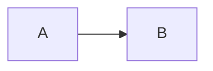

# Mermaid TUI 專案比較

<!-- Generated by chatgpt-export-markdown v1.4.0 -->

_**User (2026-09-24 10:11:07Z)**_

有人把 https://mermaid.live/ 1:1 的搬成TUI版 嗎？

---

_**Assistant (gpt-5-6-thinking, 2026-09-24 10:11:11Z)**_

我幫你查一下目前有沒有真的做到「**左邊編輯 Mermaid、右邊即時預覽、可切 theme/export，幾乎 1:1 對標 mermaid.live**」的 TUI，而不是只有 CLI render。重點會分成：現成專案、接近但不完整、以及如果自己做最適合拼哪些現成元件。

有，但我目前查到的結論是：**還沒有人把 `mermaid.live` 做成真正成熟的「1:1 TUI clone」**。

也就是你想像的這種：

```text
┌──────────── Mermaid TUI ──────────────┐
│ Source                │ Preview       │
│                       │               │
│ flowchart LR          │ ┌───┐         │
│   A --> B             │ │ A │──→┌───┐ │
│   B --> C             │ └───┘   │ B │ │
│                       │         └───┘ │
├───────────────────────┴───────────────┤
│ theme: dark  zoom 80%  SVG PNG Share │
└───────────────────────────────────────┘
```

**左邊內建 editor、右邊 realtime preview、完整 Mermaid syntax、pan/zoom、themes、export、錯誤提示**——這整套目前仍然有明顯空缺。

### 現有項目裡最接近的

| Project | 接近程度 | 差在哪 |
|---|---|---|
| `fasouto/termaid` | ⭐⭐⭐⭐ | 很強的 terminal renderer + TUI viewer，但不是完整 editor |
| `markdown-reader` | ⭐⭐⭐⭐ | 已經有 TUI live editing + Mermaid preview，但它是 Markdown IDE |
| `bnomei/nereid` | ⭐⭐⭐ | Mermaid-first TUI workspace，但 editor 主要丟 `$EDITOR`，且 syntax 是 subset |
| `dnvt/termiflow` | ⭐⭐ | 有 `--watch` / `--tui`，但目前 flowchart-only |
| `tariqshams/mermaidtui` | ⭐⭐ | Mermaid → ASCII/Unicode renderer，功能較小 |

其中我最建議你看 **termaid**。它目前已支援 18 種 diagram type，而且有真正的 interactive TUI viewer；更重要的是它直接提供 **Textual `MermaidWidget`，source 是 reactive 的**，也就是 source 改了 widget 可以 live update。([GitHub](https://github.com/fasouto/termaid?utm_source=chatgpt.com))

[fasouto/termaid](https://github.com/fasouto/termaid?utm_source=chatgpt.com)

這其實代表如果用 Python/Textual 做 `mermaid.live TUI`，**rendering half 已經有人幫你寫掉不少了**：

```python
yield TextArea(...)          # 左
yield MermaidWidget(source)  # 右
```

然後 debounce `TextArea.changed -> widget.source = text` 就基本有 Live Editor 的骨架。

---

另一個非常值得看的是 **markdown-reader**。這個其實比名字看起來厲害很多：

它有：

- Ratatui TUI
- live-preview editing
- Mermaid **16 types**
- Kitty / Sixel / iTerm2 image rendering
- Unicode fallback
- pure Rust
- 不需要 Node / Chromium
- Mermaid block 修改後重新 render

而且它已經實作了「**編輯 source ↔ rendered view**」這種 UX。([GitHub](https://github.com/leboiko/markdown-reader))

[leboiko/markdown-reader](https://github.com/leboiko/markdown-reader?utm_source=chatgpt.com)

只是它的 abstraction 是：

> Markdown repo browser/editor，其中 Mermaid 是一種 block

而不是：

> Mermaid Live Editor in terminal.

---

### Nereid 則比較像「agentic Mermaid TUI」

`bnomei/nereid` 很符合你最近在看的 agent/TUI 那條路。

它是一個 Ratatui Mermaid workspace，可以：

- browse Mermaid
- pan / navigate
- Mermaid object selection
- xref
- walkthrough
- MCP server
- AI agent structured mutation
- `e` 打開 `$VISUAL` / `$EDITOR`

但它自己也明確說只 parser 一個 **deliberate Mermaid subset**，所以不是 mermaid.live compatibility layer。([GitHub](https://github.com/bnomei/nereid))

[bnomei/nereid](https://github.com/bnomei/nereid?utm_source=chatgpt.com)

這個反而很值得參考你的：

```text
human editor
     ↕
 Mermaid AST
     ↕
 TUI renderer
     ↕
 MCP / coding agent
```

架構。

---

### TermiFlow / mermaidtui 比較像 renderer

**TermiFlow** 現在有：

```bash
tw diagram.md
tw --watch diagram.md
tw --tui diagram.md
```

但作者明確定位為 **flowchart-only wedge**，不是 full Mermaid parity；`--tui` 目前也還標成 partial。([GitHub](https://github.com/dnvt/termiflow))

[dnvt/termiflow](https://github.com/dnvt/termiflow?utm_source=chatgpt.com)

`mermaidtui` 更小，目前 v0.0.6 主要就是 flowchart subset，22 stars。([GitHub](https://github.com/tariqshams/mermaidtui))

[tariqshams/mermaidtui](https://github.com/tariqshams/mermaidtui?utm_source=chatgpt.com)

---

## 不過「1:1」其實有一個很重要的技術分岔

如果真的要 **Mermaid Live 1:1 compatibility**，我反而**不會重新實作 Mermaid parser/layout renderer**。

因為 Mermaid 本身一直在長：

```text
flowchart
sequence
class
state
ER
journey
gantt
pie
quadrant
requirement
gitGraph
C4
mindmap
timeline
zenuml
sankey
xychart
block
packet
architecture
kanban
...
```

你自己做 ASCII renderer，很快就會陷入：

> 「我其實在重新實作 Mermaid。」

`TermiFlow`、`mermaidtui`、`termaid` 都多少存在這個問題。

真正的 **mermaid.live-TUI** 我會走：

```text
                   ┌──────────────────┐
.mmd → Mermaid.js →│ SVG / PNG render │
                   └────────┬─────────┘
                            ↓
┌────────────────┐   Kitty / Sixel /
│ TUI text editor│   iTerm2 protocol
│                │        ↓
│ flowchart ...  │ │ actual Mermaid │
│                │ │ image preview  │
└────────────────┘ └─────────────────┘
```

也就是：

**左邊是真 TUI editor，右邊不是 ASCII 重畫，而是直接展示 Mermaid.js 的真實 render。**

這樣：

```text
Mermaid compatibility ≈ 100%
```

而不是：

```text
Mermaid syntax
      ↓
自己 parser
      ↓
自己 layout
      ↓
Unicode box
```

後者永遠只能 approximate。

官方 `mermaid-cli` 本來就能直接輸出 SVG / PNG / PDF。([GitHub](https://github.com/mermaid-js/mermaid-cli?utm_source=chatgpt.com))

而現在 Ghostty / Kitty / WezTerm / iTerm2 這類 terminal 已經讓「terminal 裡顯示圖片」變得相當實用了。像 `markdown-reader` 已經實際採用了 Kitty/Sixel/iTerm2 路線。([GitHub](https://github.com/leboiko/markdown-reader))

---

## 所以這個 project 其實還沒有很重複

你最近一直在找 `lazyxxx` 類 TUI，我覺得這個空缺甚至比 `lazyfind` 更明確。

例如做一個：

```bash
mmdtui architecture.mmd
```

或名字：

```text
lazymermaid
mermaid-tui
mertui
merminal
mermide
```

直接 UX：

```text
┌ Source ─────────────────┬ Preview ────────────────┐
│ flowchart LR            │                         │
│   API --> Redis         │     API ───→ Redis     │
│   API --> Postgres      │       │                │
│                         │       └──→ Postgres     │
├─────────────────────────┴─────────────────────────┤
│ NORMAL │ dark │ 72% │ ✓ valid │ :export svg     │
└───────────────────────────────────────────────────┘
```

再提供：

```text
:e / :open
:w
:theme dark
:zoom +
:fit
:export svg
:export png
:yank
:share
:examples
:config

Tab       switch pane
hjkl      pan
+/-       zoom
f         fit
e         focus editor
p         focus preview
```

以及：

```toml
# ~/.config/mermaid-tui/config.toml

editor.mode = "vim"
renderer = "mermaid-js"

preview.backend = "auto"
# auto | kitty | sixel | iterm2 | unicode

render.debounce_ms = 150

theme = "dark"

[export]
directory = "./assets"
format = "svg"
```

這樣就真的很符合你前幾天一直在研究的那類 **lazy-style：單一入口 + discoverable keybindings + XDG config + terminal native**。

### 我會選的實作

如果目標是「**真的做一個 mermaid.live TUI**」，我現在會傾向：

```text
Rust
├── ratatui                 UI
├── tui-textarea            editor
├── notify                  file watch
├── Mermaid.js / mmdc       canonical renderer
├── image protocol
│   ├── Kitty
│   ├── Sixel
│   └── iTerm2
└── optional
    └── Unicode renderer    SSH/basic terminal fallback
```

而不是從零做 Mermaid layout engine。

甚至 renderer 可以分兩層：

```text
                 ┌─ Mermaid.js → image   # fidelity mode
source → parser ─┤
                 └─ termaid/own renderer # text mode
```

因此 SSH 到普通 server 仍然可以：

```text
Unicode
```

但 Ghostty 本機就是：

```text
full fidelity image
```

**所以結論是：現在有很多零件，也有幾個做到 50–70% 的專案，但我沒找到一個真正可以稱作「mermaid.live 1:1 TUI port」的成熟項目。這個 niche 目前確實還是空的。**

尤其 `termaid + markdown-reader + Nereid` 這三個 repo，我覺得幾乎就是做這東西之前最值得拆著看的三份 reference implementation。([GitHub](https://github.com/fasouto/termaid))

---

_**User (2026-09-24 10:14:47Z)**_

還想到一個idea是 能夠parse 當前目錄下所有mermaid block （類似glow）
然後可以一次性展示 並且標注file原本位置 並且也支援轉跳 e.g. 用nvim開啟並goto file line 等等

---

_**Assistant (gpt-5-6-thinking, 2026-09-24 10:14:56Z)**_

對，而且我覺得這個 idea **比單純做 mermaid.live TUI 更有差異化**。

它會從「Mermaid editor」變成一個 **repo-level Mermaid browser / navigator**，有點像：

**`glow` × `lazygit` × `Telescope` × Mermaid Live**。

你可以把核心體驗設計成這樣：

```text
┌ Mermaid Browser ─────────────────────────────────────────────┐
│ Filter: auth                                                │
├──────────────────────────┬───────────────────────────────────┤
│ diagrams                 │ Preview                           │
│                          │                                   │
│ README.md                │  Client ───→ API ───→ DB         │
│   L42  auth flow       ● │              │                    │
│   L88  deploy flow       │              ↓                    │
│                          │            Redis                  │
│ docs/architecture.md     │                                   │
│   L17  API topology    ● │                                   │
│   L93  event pipeline    │                                   │
│                          │                                   │
│ infra/k8s.md             │                                   │
│   L105 cluster           │                                   │
├──────────────────────────┴───────────────────────────────────┤
│ README.md:42-57 │ 5/17 │ e edit │ Enter open │ / filter    │
└──────────────────────────────────────────────────────────────┘
```

然後：

```text
Enter / e
```

直接：

```bash
nvim +42 README.md
```

甚至更好：

```bash
nvim README.md +42
```

或透過 XDG config 自訂：

```toml
[openers]
editor = ["nvim", "+{line}", "{file}"]

[openers.vscode]
command = ["code", "--goto", "{file}:{line}:{column}"]

[openers.helix]
command = ["hx", "{file}:{line}"]
```

這樣就完全跟你前面 `lazyfind` 想法一致：**TUI 負責 discovery/navigation，真正編輯交給最適合的 downstream tool。**

---

## 我甚至不會只掃 `.mmd`

預設 scan：

```text
*.md
*.mdx
*.markdown
*.mmd
*.mermaid
```

Markdown 裡抓：

````markdown

````

同時記錄一個 block metadata：

```rust
struct MermaidBlock {
    path: PathBuf,
    start_line: usize,
    end_line: usize,
    index: usize,

    title: Option<String>,
    source: String,
    diagram_type: DiagramType,

    hash: u64,
}
```

這裡 `start_line` 特別重要。

因為之後所有 UX 都可以圍繞：

```text
repo-relative path + line range
```

所以 block 自己其實就是一個 **virtual document**：

```text
README.md#L42-L57
docs/design.md#L103-L128
```

---

## 不要純 regex parse Markdown

第一版 regex 當然可以：

```regex
```mermaid
...
```
```

但如果打算真的做成 tool，我會很快換成 Markdown parser。

Rust 可以考慮：

```text
tree-sitter-markdown
pulldown-cmark
markdown-rs
```

其中如果你很重視：

- source position
- incremental parsing
- editor integration
- MDX / weird markdown

我會比較偏 **tree-sitter**。

因為你的真正需求不是：

> 「知道 Markdown 裡有 Mermaid。」

而是：

> 「知道 Mermaid block 精確出現在哪個 byte/line range。」

Tree-sitter 天然適合。

---

## Repo scanning 也可以直接吃成熟生態

不要自己做：

```text
recursive walk
.gitignore parsing
hidden files
binary detection
```

Rust 直接用 ripgrep 那套：

```text
ignore crate
walkdir
```

`ignore` crate 就是 BurntSushi 為 ripgrep 做的那套 traversal。

因此可以自然遵守：

```text
.gitignore
.git/info/exclude
global gitignore
hidden files
symlinks
```

再自己提供：

```toml
[scan]
include = ["**/*.md", "**/*.mmd"]
exclude = ["vendor/**", "node_modules/**"]

respect_gitignore = true
hidden = false
```

---

## UX 還能比 Mermaid Live 強很多

因為 Mermaid Live 的 unit 是：

```text
one diagram
```

你的 unit 是：

```text
repository
  └── documents
       └── diagrams
```

所以自然可以有：

```text
g f       group by file
g t       group by diagram type
g d       group by directory

/         fuzzy filter
t         filter diagram type
e         edit
y         yank Mermaid source
Y         yank rendered SVG
o         open generated image
r         rerender
R         rescan repo
]         next diagram
[         previous diagram
```

甚至可以：

```text
:export all
```

一次生成：

```text
.build/mermaid/
├── README-L42.svg
├── README-L88.svg
├── architecture-L17.svg
└── event-pipeline-L93.svg
```

這對 documentation repo 很實用。

---

## 還可以自動從附近 Markdown 抽 title

例如：

````markdown
## Authentication flow

blah blah

```mermaid
sequenceDiagram
...
```
````

UI 不一定要顯示：

```text
README.md:L42
```

可以顯示：

```text
README.md
└─ Authentication flow                  L42
```

算法甚至很簡單：

> Mermaid block 往上找最近的 Markdown heading。

這個 UX 會差非常多。

再進一步可以建立 breadcrumb：

```text
docs/architecture.md
└── Backend
    └── Authentication
        └── Login flow                  L173
```

---

## 甚至可以反過來做「diagram outline」

左邊除了檔案之外，可以解析 Mermaid 本身：

```text
Authentication flow
├── Client
├── API
├── OAuth
├── Redis
└── Database
```

例如選 `OAuth`：

```text
Enter
```

highlight preview 裡的 OAuth node。

這時就開始接近 IDE 的：

```text
Symbols / Outline
```

而不是單純 renderer。

Nereid 那種 structured Mermaid AST 的思路，在這裡就非常適合。

---

## Watch mode 也會很好用

```bash
mermaid-tui .
```

進去之後 filesystem watch：

```text
README.md changed
      ↓
只重新 parse README.md
      ↓
affected Mermaid block hash changed
      ↓
rerender affected diagrams
```

不要每次：

```text
scan whole repo
render whole repo
```

cache 可以：

```text
path
mtime
source hash
render hash
```

所以大 repo 一樣很輕。

---

## CLI 本身也可以非常 Unix

我會讓 TUI 只是其中一個 frontend：

```bash
mmd ls
mmd view
mmd grep auth
mmd render
mmd edit
```

例如：

```bash
$ mmd ls

README.md:42        flowchart   Authentication flow
README.md:88        sequence    Login sequence
docs/arch.md:17     flowchart   Service topology
docs/arch.md:103    erDiagram   Database schema
```

於是：

```bash
mmd ls | fzf
```

也 work。

或者：

```bash
mmd edit README.md:42
```

直接跳 editor。

甚至：

```bash
mmd show docs/arch.md:17
```

terminal render。

所以 architecture 可以乾淨地拆成：

```text
               ┌─ CLI ls
scanner/parser ─┼─ CLI render
               ├─ TUI browser
               ├─ MCP
               └─ editor plugin
```

這點我覺得很重要：**不要把核心能力綁死 Ratatui。**

---

## 我會把 scope 定義成這樣

與其叫：

> Mermaid Live for terminal

我反而會把它定義為：

> **A repository-aware Mermaid explorer for the terminal.**

核心三件事：

```text
discover
   ↓
preview
   ↓
jump/edit
```

也就是：

```text
find every Mermaid diagram
        ↓
browse/render all of them
        ↓
jump back to exact source
```

這其實是目前 `mermaid.live`、`mmdc`、`glow` 各自都沒有完整解決的 workflow。

而且它跟你之前想的 `lazyfind` 有個很漂亮的共同理念：

> **TUI 不取代專業工具，而是做 discovery + context + routing。**

Mermaid TUI 負責找到 diagram、提供 context、render；  
真的要改 → `nvim`；  
真的要生成 canonical SVG → `mmdc`；  
想看 Markdown → `glow`；  
想讓 agent 操作 → MCP。

我反而覺得這個定位比「再做一個 Mermaid renderer」值得做很多。
