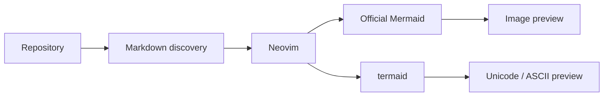
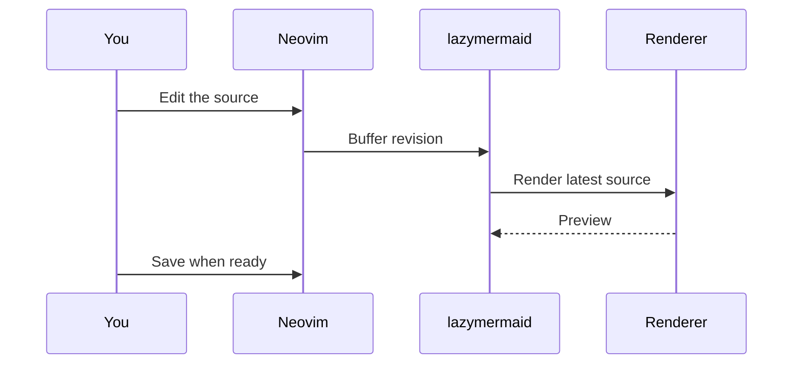

# lazymermaid architecture

## Explore and edit

```mermaid
flowchart LR
    Repo[Repository] --> Scan[Markdown discovery]
    Scan --> Editor[Neovim]
    Editor --> Mermaid[Official Mermaid]
    Editor --> Termaid[termaid]
    Mermaid --> Image[Image preview]
    Termaid --> Text[Unicode / ASCII preview]
```

## Unsaved changes

```mermaid
sequenceDiagram
    participant You
    participant Editor as Neovim
    participant App as lazymermaid
    participant Renderer
    You->>Editor: Edit the source
    Editor->>App: Buffer revision
    App->>Renderer: Render latest source
    Renderer-->>App: Preview
    You->>Editor: Save when ready
```
